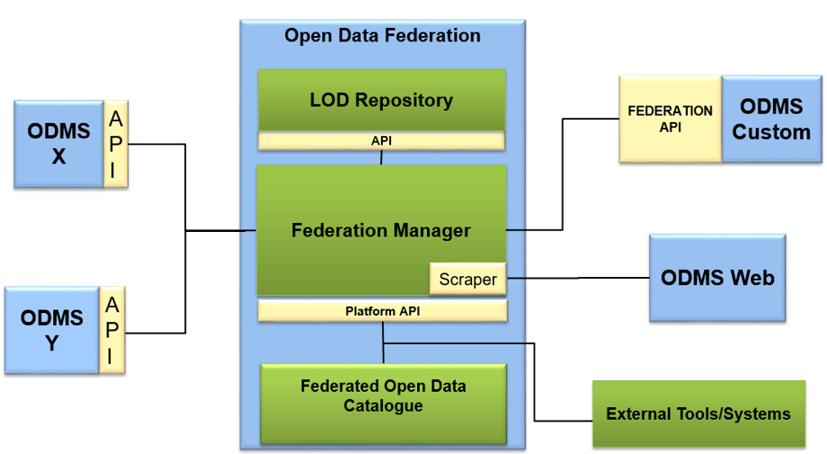

# Architecture Overview

Open Data Federation provides access to resources of federated ODMSs from a single-entry point through a set of APIs and is able to retrieve, search and visualize datasets from different ODMSs. The
platform is responsible for collecting metadata of Open Data from federated ODMS catalogues and then for translating them into a common and uniform format. In addition, it manages Linked Open Data
(LOD), importing them into a specific repository in order to perform queries on them.
The following picture illustrates the architecture of the Open Data Federation.

It's main components are:

- **Federation Manager**: is the core of the platform that interacts with federated ODMS catalogues; it is responsible for managing internal federation processes. It provides the main functionalities
through Platform API in order to be accessed by external application or by the Federated Open Data Catalogue. Main functionalities provided by the FM are:
    - ODMS catalogues management: registration, removal and monitor.
    - Federated full text search: possibility to search for specific Open Data on the federated ODMS catalogues.
    - Federated queries on Linked Open Data.
    - Federation configuration management

- **LOD Repository**: is the central store in which collected Linked Open Data retrieved from federated ODMS catalogues are stored, in order to perform queries on them and to provide collected results in different formats.

- **Federated Open Data Catalogue**: is a web application that allows end users to access the FM functionalities calling the Platform API. In particular, the Federated Open Data Catalogue allows to:
    -   Manage administrator authentication
    -   Search for Open Data/Linked Open Data, visualise and manage results
    -   Manage Federation and configuration.

The Federation Manager functionalities can be also accessed by a generic external system (e.g. client application) using the Platform API.
It is important to underline that each ODMS catalogue depicted in the picture is a generic system that manages OD/LOD. Usually it consists in a web portal associated to a database. In order to be federated in the ODF, the ODMS has to provide some basic functionalities through RESTful APIs. One of the objectives of the ODF is to allow the federation of different ODMSs with minimum effort. Different type of ODMS catalogues will be natively supported by ODF: CKAN, Socrata, DKAN or portals that provides the datasets through a DCAT-AP or DCAT-AP_IT dump; ODF provides Federation API Specification to allow “custom ODMS catalogues” to join the federation; moreover, custom ODMS catalogues that does not provide APIs can join the federation through the scraping of its web portal.   
